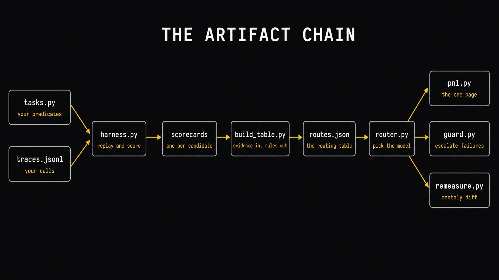
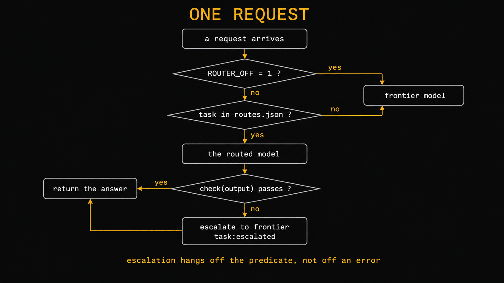

# frontier-tax

**Measure what a cheaper model does to your own work, then route each task to the cheapest model your own numbers say can pass it.**

The companion repository to *Stop Funding the Frontier*, at [youcanbuildthings.com](https://youcanbuildthings.com).
Every artifact in the book, laid out chapter by chapter, so you can clone the system instead of
retyping it.



Nobody else's benchmark is proof: you measure a cheaper model on *your* own traces, and route on
the number you get.

## Start here: your first 15 minutes

Five steps, in order. You don't need the whole picture first, and nothing here needs a key or the
network.

**1. See the finished artifact.**

```
python3 chapters/10-defended-swap/pnl.py \
    fixtures/traces.sample.jsonl fixtures/traces.sample.jsonl 14 14
```

It prints the one-page swap decision off the bundled **synthetic** sample. A real row from it:

```
code-review           56      4.05      4.05     0.00    85% (n=40)   85% (n=40)
```

The same file is the before and the after, so `saved` is zero by construction. You're reading the
*shape*, not a result; the numbers belong to nobody, and become yours when two of your own trace
files go in.

**2. See where the numbers come from.**

```
python3 chapters/02-read-your-bill/billsplit.py fixtures/usage.sample.jsonl
```

**3. See how "good" gets decided.** Open `chapters/03-cost-per-task/tasks.py` and read its two
predicates. This is the file everything imports; writing your own is the real work later.

**4. Skim "Point it at your own work"** below: the path from this sample to your own data.

**5. Stop.** You now know the workflow, the whole system in five moves:

> log traces  ->  write predicates  ->  score models  ->  build routes  ->  print the P&L

The rest is detail, one chapter at a time.

## The words, in plain English

- **trace:** one logged model call: its model, task, tokens and real cost. They pile up in `traces.jsonl`.
- **predicate:** a `check(output, trace) -> bool` you write, one per task type, that decides whether an answer passed.
- **scorecard:** the harness's verdict on one model for one task: pass rate, confidence interval, cost per task.
- **route:** a rule in `routes.json` sending a task type to the cheapest model that passed. `router.py` reads it.
- **guardrail:** scores every routed answer and re-runs the failures on the frontier, so a wrong cheap answer never ships.
- **P&L:** the one page, computed from your traces, showing what moved to a cheaper model, what stayed, and why.

## What this is, honestly

Every script reads *your* file and won't print a number it didn't compute from it. There are no
results here, and no savings percentage: leading with a saving would commit the exact failure the
book spends twelve chapters attacking.

Three groups of tools, and telling them apart matters:

- **Analysis, no key and no network.** `billsplit.py`, `cpt.py`, `tasks.py`, `rollup.py`, `build_table.py`, `pnl.py` and the pure helpers (`join()`, `advisor_aware_usage()`, `diet.verdict`, `context_profile.py`, `subs_vs_api.py`) run on files you already have, no `.env` and no `pip install`. The bundled synthetic fixtures feed them until you point them at your own.
- **Replay, spends your money.** `harness.py`, `remeasure.py`, `diet.score()`, `guard.py` and `providers.complete()` send a real prompt to a real model, usually under a dollar for a 40-trace run. Nothing stubs a candidate model to look cheaper: a scorecard against a fake model is the artifact this whole book argues against. `pip install openai` here; it's the only dependency, and sixteen of the twenty-two files never touch it.
- **Documented, not verified here.** The `vllm serve` and `ollama` commands in chapter 6, and the advisor beta call in chapter 8, come from those projects' own docs and were never run on the machine this was built on. Documented, not tested. Everything else has a test.

One oddity: `router.route()` reads like analysis, a dictionary lookup, but its module imports the
client at the top, so importing it needs `openai` even though the call never hits the network.
Same for `guard.py`, `shadow.py` and `call_role.py`; `sdk_patch.py` wants `anthropic`.

## The chapter map

Where to go next. `spends money` marks the steps that call a real model; the rest run on the
bundled sample.

| Chapter | What you build | Run it | Success looks like |
|---|---|---|---|
| 1 | no folder; the deliverable is a number you write in pen | . | last month's spend, and "I don't know" under it |
| 2 | `billsplit.py`, `record_usage.py` | `python3 chapters/02-read-your-bill/billsplit.py fixtures/usage.sample.jsonl` | four line items; you name which is over half the bill |
| 3 | `tasks.py`, `cpt.py` | `python3 chapters/03-cost-per-task/tasks.py` → `True False` | it tells a real answer from a hallucinated one |
| 4 | `tracelog.py`, `rollup.py`, `logproxy.py`, `sdk_patch.py` | `python3 chapters/04-instrument/rollup.py fixtures/traces.sample.jsonl` | a real `$/CALL` per task type, off your own work |
| 5 | `harness.py`, the core artifact | `harness.py <traces> --task T --baseline B --candidate C` · **spends money** | you can say the sentence with real numbers in it |
| 6 | `providers.py` | see the folder README, the six env vars first | one word on the command line swaps provider class |
| 7 | `build_table.py`, `router.py`, `shadow.py` | `python3 chapters/07-router/build_table.py` | `routes.json`, with a sample size in every `why` |
| 8 | `roles.json`, `call_role.py`, `fanout.py`, `advisor_usage.py` | see the folder README · **spends money** | cost down, and you name which role dominated |
| 9 | `diet.py`, `context_profile.py` | `python3 chapters/09-the-diet/context_profile.py fixtures/traces.sample.jsonl` | input- or output-dominated: you now know which |
| 10 | `pnl.py`, `subs_vs_api.py` | the first command, above | one page a skeptic can check |
| 11 | `guard.py`, `keep-list.example.md` | see the folder · **spends money** | you broke it on purpose and the escalation fired |
| 12 | `remeasure.py` | `python3 chapters/12-re-measure/remeasure.py traces.jsonl` · **spends money** | one command shows what moved since last month |

Five folders carry a README, the ones whose setup wouldn't fit in a docstring. The rest don't
need one.

## Point it at your own work

The section the repo exists for. Four steps.

**1. Log a day.** Wire `tracelog.traced()` into one call site (or drop `logproxy.py` between your
tool and its provider if you don't own it) and work a day. Tag every call with a task type, a short
string naming the work. Without that tag you have a nicer bill, not a dataset.

```
tail -1 traces.jsonl | python3 -m json.tool | grep cost_usd
```

A number means you're fine. `null` means your model string isn't in `RATES`.

**2. Write two predicates.** In `chapters/03-cost-per-task/tasks.py`, delete both examples and
write `check(output, trace) -> bool` for your two most common paid tasks, one boring and one hard.
Sanity-check each against a known-good and a known-bad output, which is what running `tasks.py`
does.

**3. Score one candidate.** Point the harness at your highest-*total*-cost task type, not the
highest per-call one.

```
BASE_URL=https://your-provider/v1 API_KEY=sk-... \
python3 chapters/05-quality-delta/harness.py traces.jsonl --task code-review \
    --baseline claude-opus-4-8 --candidate deepseek-v4-flash --limit 40 \
    --out scorecards/code-review__ds-flash.json
```

Read your baseline's pass rate first: 100% means the predicate is too loose, under 60% too strict.
Fix it and rerun before concluding.

**4. Build the table and read the page.**

```
python3 chapters/07-router/build_table.py            # scorecards/*.json -> routes.json
python3 chapters/10-defended-swap/pnl.py traces_before.jsonl traces_after.jsonl 14 14
```

Everything else hangs off those two files: router, tiered agent, diet, guardrail, monthly
re-measurement.

## One request, end to end



Two branches here exist in no gateway. An unrecognized task goes to the *most capable* model, never
the cheapest, because unmeasured work hasn't earned a discount. And escalation hangs off your
predicate, not off an error, so a provider failover that reroutes a timeout will still never notice
a fast, confident, completely wrong answer.

`ROUTER_OFF=1` sends everything back to the frontier with no redeploy. Write that down where the
person on call at 3am will find it.

## Inside one agent


The split-billing trap that makes your logger report 7% of a call's real cost is covered in
`chapters/08-tiered-agent/README.md`.

## Testing

```
python3 -m unittest discover tests
```

Offline, no keys, stdlib only. The suite runs the same whether or not `openai` is installed;
nothing in it calls a model, and a test that pretended to would manufacture the receipt this book
argues against.

## Files this repo will never hold

`traces.jsonl`, `usage.jsonl`, `scorecards/`, `routes.json`: all gitignored. Your trace file
contains your prompts, and whatever your prompts contain, it now contains. The classic version is
committing three weeks of customer data to a public repo alongside a nice cost-reporting tool.

## License

MIT. See [LICENSE](LICENSE). Educational software that accompanies the book, provided as-is,
with no warranty.
