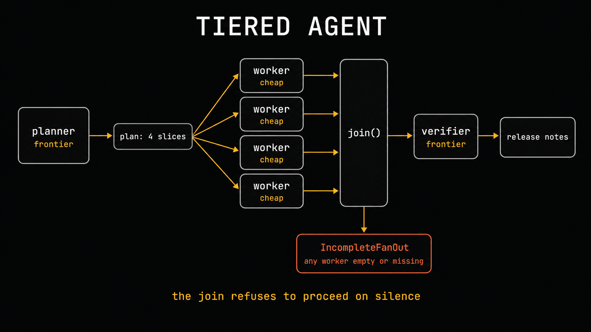

# Chapter 8: the tiered agent



*The tiered agent: an expensive planner splits the job, cheap workers grind through the slices,
a status-gated join refuses to proceed on silence, and an expensive verifier reads what came
back. `IncompleteFanOut` is the join's refusal.*

`roles.json` is one worked example. Replace `changelog-agent` with your own agent and its own
tiers, then run the job both ways on the same inputs and score both through the harness. A
tiered agent that's 60% cheaper and fails one job in five is not a saving.

## The split-billing trap

If your executor calls an advisor, the top-level `usage` block on the response counts the
**executor only**. The advisor's sub-inferences arrive in `usage.iterations[]` with
`type: "advisor_message"` and bill at the advisor's rate. Your Chapter 4 logger reads top-level
usage, so it will under-report this pattern and make it look far cheaper than it is.

The arithmetic on one plausible call — a Sonnet 5 executor burning 1,200 in and 400 out, calling
an Opus 4.8 advisor once that reads 9,000 tokens of transcript and writes 1,500:

```
executor  1,200 in x $2/1M  +  400 out x $10/1M   = $0.00640
advisor   9,000 in x $5/1M  + 1,500 out x $25/1M  = $0.08250
                                            true  = $0.08890
```

Your logger reports $0.00640. That's **7%** of what the call actually cost. `advisor_aware_usage()`
pulls the iterations out so you can price them at their own rate; there is a test pinning that
arithmetic.

One more choice that isn't cosmetic: a Fable 5 or Mythos 5 advisor returns
`advisor_redacted_result` and you can't read the advice. A `claude-opus-4-8` advisor returns
plaintext. Since most of the value here is learning what the smart model told the cheap one,
take the readable one for anything you intend to iterate on.

**Not tested here:** the advisor beta call itself. It needs a live paid beta endpoint. The
arithmetic above and the usage-splitting function are tested; the API call is documented.
